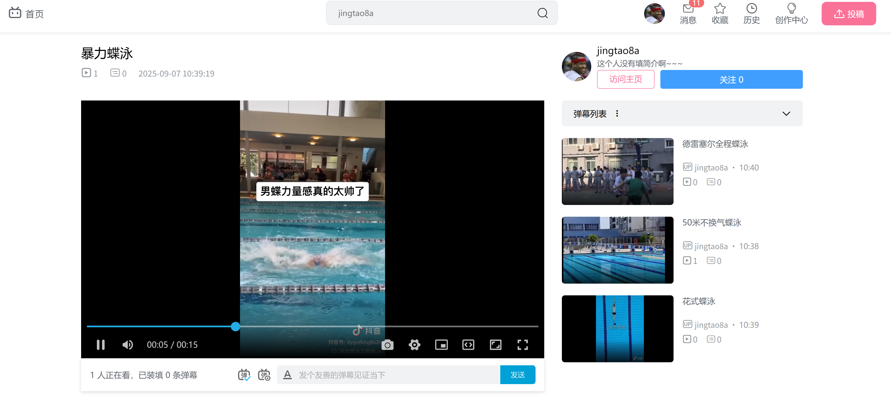

# 创享视界
一个类似于 B 站的视频资源共享平台，分为管理员和用户端两个部分：用户可以进行视频投稿、发评论、发弹幕、关注用
户、视频点赞/收藏/投币、评论点赞/讨厌；管理员可以对添加视频分类、审核稿件、管理评论/弹幕





---
# 功能介绍
[项目简介](./doc/项目简介.md)

管理端(doc/admin目录详细描述了这部分的功能)
- [视频分类管理](./doc/admin/分类管理.md)
- [所有(弹幕管理](./doc/admin/弹幕管理.md)
- [文件上传](./doc/admin/文件上传.md)
- [管理员登入](./doc/admin/登入注册.md)
- [所有稿件管理](./doc/admin/稿件管理.md)
- [所有评论管理](./doc/admin/评论管理.md)

访客端(doc/web目录下详细描述了这部分功能)
- [个人主页](./doc/web/个人主页.md)
  - [个人主页-粉丝关注](./doc/web/个人主页-粉丝关注.md)
  - [个人主页-视频集合](./doc/web/个人主页-视频集合.md)
- [主站获取视频分类](./doc/web/分类管理.md)
- [创作中心](./doc/web/创作中心.md)
  - [创作中心-弹幕管理](./doc/web/创作中心-弹幕管理.md)
  - [创作中心-稿件管理](./doc/web/创作中心-稿件管理.md)
  - [创作中心-评论管理](./doc/web/创作中心-评论管理.md)
- [发弹幕](./doc/web/发弹幕.md)
- [发评论](./doc/web/发评论.md)
- [用户文件上传](./doc/web/文件上传.md)
- [用户行为管理](./doc/web/用户行为管理.md)
- [用户登入注册](./doc/web/登入注册.md)
- [视频转码线程池](./doc/web/视频转码线程池.md)
- [首页视频](./doc/web/首页视频.md)

mysql初始化建表脚本：[init.sql](./doc/init.sql)

---
# 部署
1. docker使用指南<br>
[linux科学上网](https://v2raya.org/docs/prologue/quick-start/)<br>
[docker安装](https://yeasy.gitbook.io/docker_practice/install/ubuntu)<br>
[docker网络代理](https://yeasy.gitbook.io/docker_practice/advanced_network/http_https_proxy)
2. 在内网的主机上配置好环境后，执行[local_deploy.sh](./local_deploy.sh)一键部署，通过[docker-compose-dockerfile](./docker-compose-dockerfile/README.md)目录下的Dockerfile构建镜像，之后再创建相应的容器<br>
docker-compose-dockerfile的目录结构如下
    ```shell
    docker-compose-dockerfile
    ├── README.md
    ├── easy-live
    ├── elasticsearch
    ├── mysql
    ├── nginx-admin
    ├── nginx-web
    └── redis
    ```
    该脚本要构建6个镜像，之后在一个network分别启动容器
   - [easy-live](./docker-compose-dockerfile/easy-live/README.md)
   - [elasticsearch](./docker-compose-dockerfile/elasticsearch/README.md)
   - [mysql](./docker-compose-dockerfile/mysql/README.md)
   - [nginx-admin](./docker-compose-dockerfile/nginx-admin/README.md)
   - [nginx-web](./docker-compose-dockerfile/nginx-web/README.md)
   - [redis](./docker-compose-dockerfile/redis/README.md)

3. 申请公网的云服务器，并配置nginx服务
4. 使用frp内网穿透工具，将内网服务暴露到公网上<br>
[frp最佳实践](https://zhuanlan.zhihu.com/p/529308715)
5. 最终部署架构如下<br>


---

# 设计中的难点
1. 后端返回一批item列表需要按指定的顺序返回<br>
> 给每个item对应的table添加一个字段sort用于表示序号，用sql进行查询时使用sort进行排序

2. 设计分类分类管理<br>
> 有一级分类和二级分类，每个二级分类属于某个一级分类，类似于文件系统中的文件树结构，所有一级分类的有一个虚拟的父类id（0），类似于根目录，评论的设计也类似这样

3. 设计视频表结构<br>
> 由于每个video包含不同的分p，并且需要区分 投稿状态 和 发布转态 的两种video，这里设计了四张表video_info_post、video_info_file_post、video_info、video_info_file
带post后缀的表示是投稿状态的video和分p，video_info_post多了一个status字段（0:转码中 1:转码失败 2:待审核 3:审核成功 4:审核失败）,video_info_file_post多了一个transfer_result字段（0:转码中 1:转码成功 2:转码失败）和upload_id字段（后台线程从redis的List读取转码任务时，这是唯一ID用于保证消息的不重复性），只有一个video_info_post下的所有video_info_file_post都转码成功，它的status才会被设置为待审核；
不带post后缀的表示审核成功处于发布状态的video和分p，video_info要多一些其它字段（播放数量、点赞/投币/收藏数量、评论/弹幕数量以及是否推荐）

4. 弹幕、评论、播放、点赞、投币、收藏数量的并发更改<br>
> - 对于弹幕、评论、点赞、投币、收藏数量的并发更改使用的是乐观锁，是在数据库层面实现的（版本号机制）
> - 对于播放数量的并发更改实现机制为将每个播放信息发送到消息队列中(List)，由后台线程进行消费，增加对应video_info的播放数量，并更新video_play_history表
> - 也可以利用redis执行指令的原子性更新某个对应的数量，之后在同步到mysql数据库中

5. 文件上传的实现<br>
> - 对于小文件（图片），直接上传，服务侧会将其保存在磁盘上，可以选择是否通过生成缩略图（会加上特殊的后缀例如_thumbnail.jpg），并返回存储路径。
> - 大文件（视频）上传，需要进行切分，因为使用http的range机制会超时，分为两阶段：第一阶段前端将视频切分为多个chunk，将filename和chunks发送给服务器，服务器会生成一个独有的upload_id，并在redis中存储{redis, UploadingFileDto}，UploadingFileDto记录了本次上传文件进度（上传了几个chunk），并返回upload_id；第二阶段前端将不同的chunk和chunk的序号index发送给服务端，并带上upload_id，服务端会实时更新UploadingFileDto

6. 在线人数统计<br>
> - 后端使用redis对每个单独的video进行计数，这里使用的key有两种：（1）userPlayOnlineKey：{fileId+deviceId, fileId}，设置过期时间为8秒(2)playOnlineCountKey：{fileId, count}，设置过期时间为10秒。对于单个视频有一个playOnlineCountKey和多个userPlayOnlineKey，playOnlineCountKey的值为userPlayOnlineKey的数量，当userPlayOnlineKey新增时，playOnlineCountKey加1；当userPlayOnlineKey过期时，触发监听事件，playOnlineCountKey减1。每次前端查询观看次数时都会更新两种key的过期时间,前端通过轮询的方式实时更新
> - （待改进：前端通过事件监听用户行为，发送join/leave等信号。后端用 Redis 维护视频计数器和在线用户 Set，处理信号并更新计数。
用 WebSocket 将最新计数推送给前端，实现实时展示）

7. 用户收藏列表的获取<br>
> mysql数据库中设计了一张user_action表，用于记录用户行为（喜欢/讨厌评论，点赞/投币/收藏视频），可以查询到某个用户的收藏行为，然后关联查询对应的视频列表

8. 用户视频序列归档设计<br>
> mysql数据库表中设计了两张表user_video_series和user_video_series_video，一个user_video_series对应多个user_video_series_video，user_video_series存储序列ID和用户ID，user_video_series_video存储序列ID和视频ID

9. 项目中elasticsearch的作用<br>
> - 基于倒排索引来实现检索，创建一个index（设定一个固定结构），然后加入多个doc，每个doc对应多个filed，如果一个field定义了analyzer（分词器），将使用该类型的分词器对该field进行分词，之后创建的倒排索引就是一个分词对应多个doc，并且查找时会对搜索词进行分词，然后再分别进行匹配
   在本项目中，有两个地方使用了elasticsearch进行查询
> - 在搜索时，只对这两个videoName和tags这两个field进行检索
> - 在搜索框进行搜索时
  在搜索结果时，可以按照以下类型排列
```java
public enum SearchOrderTypeEnum {
    VIDEO_PLAY(0, "playCount", "视频播放数"),
    VIDEO_TIME(1, "createTime", "视频时间"),
    VIDEO_DANMU(2, "danmuCount", "视频弹幕数"),
    VIDEO_COLLECT(3, "collectCount", "视频收藏数"),
    ;
}
```
> - 打开一个视频后，右侧展示推荐的视频时

10. 待优化的点<br>
> - 拆分为微服务，提高服务的高可用（可以从兜底策略出发），（主站服务、文件资源上传服务、互动服务、管理端服务），可以弹性扩容（节省资源）
> - 前后端通信可以使用protobuf序列化+压缩的方式减少数据包大小，减少网络IO
> - 如果数据量很大，使用分布式存储服务，进行数据库的分库、分表

---
# 其它
- [elasticsearch简介](./doc/other/elasticsearch.md)
- [HTTP协议](./doc/other/HTTP协议.md)
- [Mysql-基础-索引](./doc/other/Mysql-基础-索引.md)
- [Mybatis使用中遇到的问题](./doc/other/Mybatis.md)
- [SpringBoot参数校验](./doc/other/spring-boot-starter-validation.md)
- [Spring事务](./doc/other/Spring事务.md)
