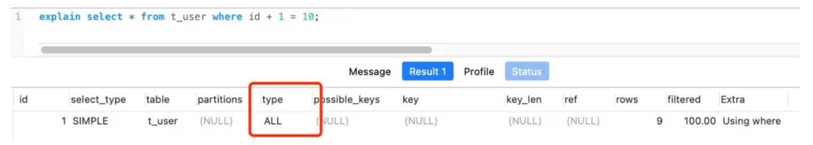
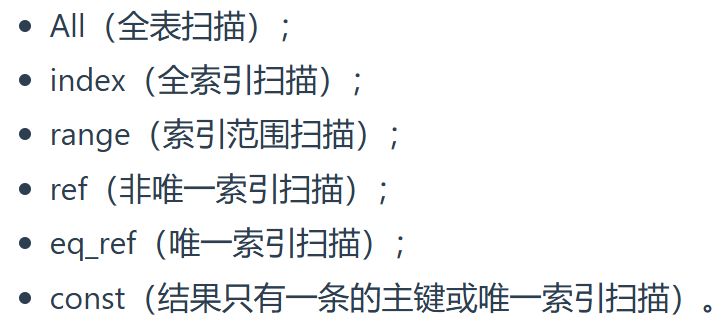
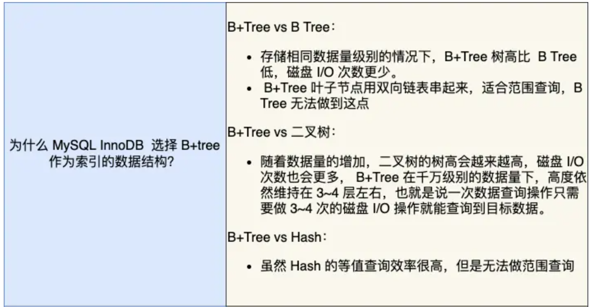

## Mysql执行流程
连接器->查询缓存->解析器->优化器->执行器->存储引擎

## 数据库索引分类
- 按照 物理存储 分类：聚簇索引、二级索引
- 按照 字段特性 分类：主键索引、唯一索引、普通索引、前缀索引
- 按照 字段个数 分类：单列索引、联合索引

## 优化索引的方法
### 1.前缀索引优化
在一些大字符串字段作为索引key时，可以提高查询速度
**局限**:  
1. order by子句无法使用该优化方法 
2. 无法避免回表 

### 2.覆盖索引优化
避免回表

### 3.主键最好是自增
插入新数据，主键索引都是追加操作，不需要移动数据，效率很高

### 4.属性最好设置为 NOT NULL
reason1: 属性存在NULL，会导致优化器在做索引选择时更复杂
reason2: NULL是一个没有意义的值

### 5.防止索引失效
#### 失效的场景：
1. 左或左右模糊匹配时：like %xx 或者 like %xx%
2. 在查询条件中对索引列做了计算、函数、类型转换操作
3. 使用联合索引时，违反了最左匹配原则
4. 在WHERE子句中， 如果OR前的条件列是索引列，OR后的条件列不是索引列
    > 因为OR的含义就是两个只要满足一个即可，只有一个条件列是索引列是没有意义的，还是得全表扫描

#### EXPLAIN查看执行计划

1. possible_keys: 可能用到的索引
2. key: 实际用的索引
3. key_len: 索引字段的长度
4. rows: 表示扫描的数据行数
5. type: 表示数据扫描类型

重点是type

## InnoDB选择B+Tree的原因

## 索引下推
截断的字段不会在server层进行条件判断，而是下推到存储引擎层进行条件判断