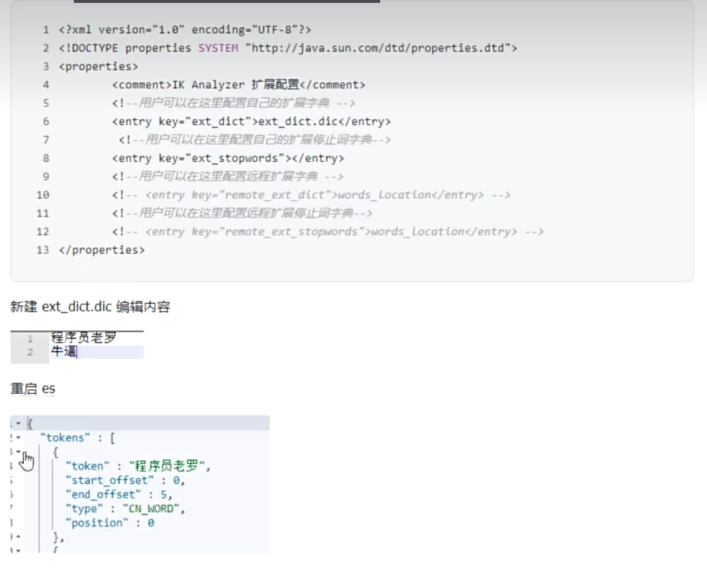
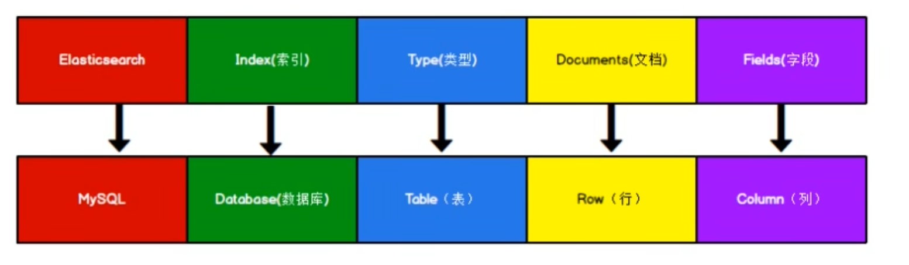

## Elasticsearch
配置文件目录: elasticseaerch-7.12.1/config/elasticsearch.yml
ip-port: localhost:9200

## kibana
url: http://localhost:5601/app/home#/


## 分词
IK分词器包含两种模式:
- ik_smart: 最少切分
- ik_max_word: 最多切分
- standard(标准分词，对中文不友好)
```
GET /_analyze
{
    "analyzer": "ik_max_word",
    "text": "程序员老罗教学太牛逼了"
}
```

## 扩展词典
在elasticsearch-7.12.1/plugins/ik/config/IKAnalyzer.cfg.xml中修改


## 数据格式
Elasticsearch是面向文档型数据库，一条数据就是一个文档

这里Types的概念已经被逐渐弱化，在es6.X中，一个index下已经只能包含一个type，es7.X中，type的概念已经被删除了

## 索引操作
### 1. 创建索引
PUT http://localhost:9200/index_name

### 2. 删除索引
DELETE http://localhost:9200/index_name

## 3. 获取索引相关信息
- 获取单个索引详细信息
> GET http://localhost:9200/index_name

- 获取所有索引信息
> GET http://localhost:9200/_cat/indices?v

## 4. 创建文档
POST http://localhost:9200/index_name/_doc<br>
```json
//request body
{
    "title": "小米手机",
    "category": "小米",
    "images": "fjlkdafl",
    "price": 2332
}
```

## 5. 获取索引下文档信息
- 获取单个文档信息
> GET http://localhost:9200/shopping/_doc/1002

- 获取所有文档信息
> GET http://localhost:9200/shopping/_search

## 6. 修改文档
- 全量修改
> POST http://localhost:9200/shopping/_doc/1001
```json
//request body
{
    "title": "小米手机",
    "category": "小米",
    "images": "fjlkdafl",
    "price": 2332432
}
```

- 局部修改
> POST http://localhost:9200/shopping/_update/1001
```json
//request body
{
    "doc": {
      "title": "华为手机"
    }
}
```

## 删除文档
DELETE http://localhost:9200/shopping/_doc/1001

## 条件查询
- GET http://localhost:9200/shopping/_search?q=category:小米

- POST http://localhost:9200/shopping/_search
```json
//request body
{
  "query": {
    "match": {
      "title": "小米"
    }
  }
}
```

## 分页查询
- POST http://localhost:9200/shopping/_search
```json
//request body
{
  "query": {
    "match_all": {
      "title": "小米"
    }
  },
  "from": 0,
  "size": 1
}
```
